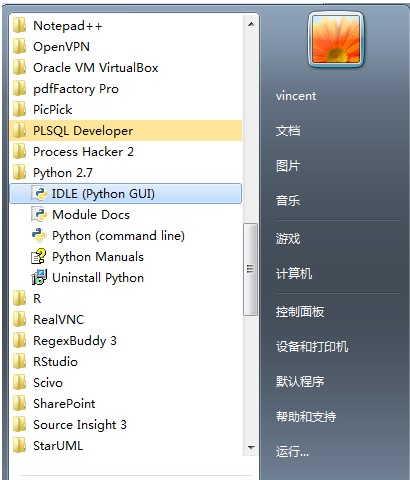
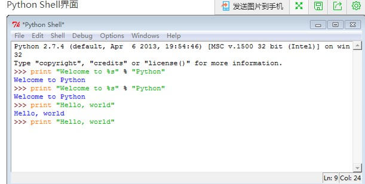
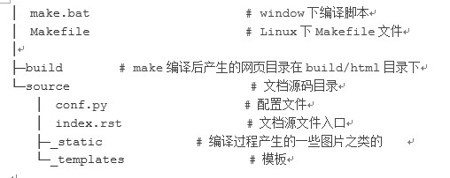
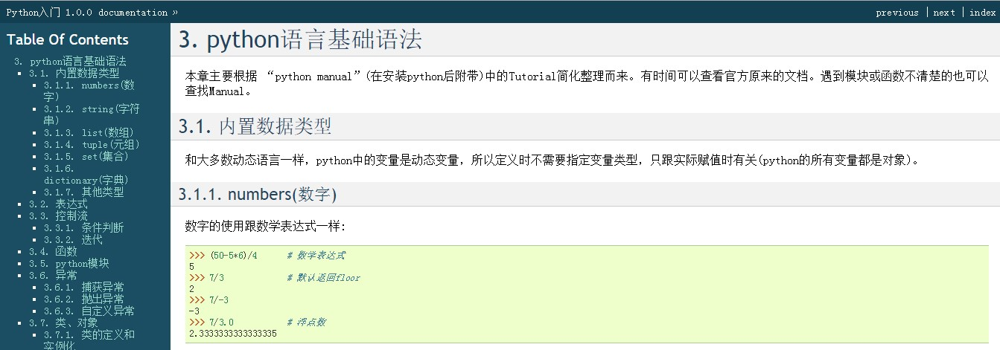
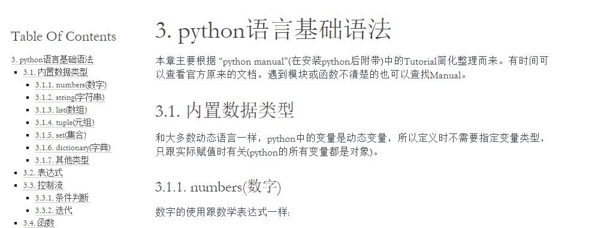
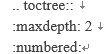
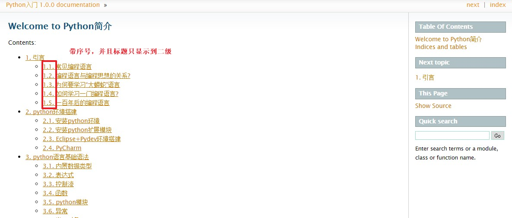
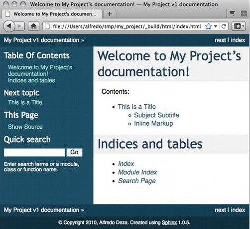
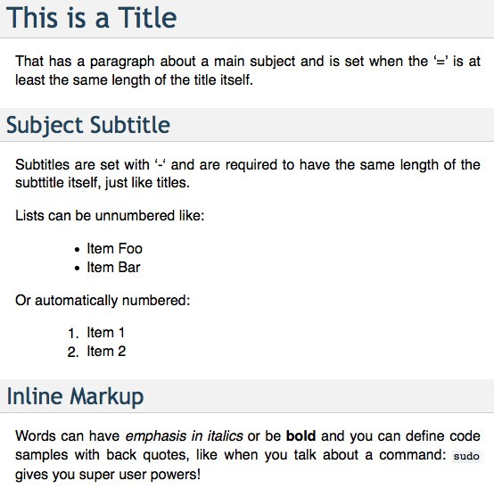

搭建Sphinx
==========
安装python
----------
sphinx依赖于python，所以要先安装python环境，并安装pip工具

下载并安装python for windows：https://www.python.org/downloads/windows/
 * 下载python2.7安装包
 * 安装python
 * 添加到系统路径，如python安装到 C:\python27 下，则添加 ;C:\\Python27;C:\\Python27\\Scripts 到系统环境变量Path的后面，后面那个路径一般是easy_install，pip等扩展工具安装的目录。
 
安装完python包后，python自带一个交互式shell，一个命令行，及一些文档。

输入代码，如图输出证明python安装完成。

easy_install安装和使用
----------------------
1.	下载ez_setup.py 地址： https://bootstrap.pypa.io/ez_setup.py（我用火狐下的，我的360没弹出下载窗口）

2.	python ez_setup （运行此命令）

3.	easy_install sphinx   （运行此命令）

pip安装和使用
-------------
1.	下载 get-pip.py脚本 地址： https://bootstrap.pypa.io/get-pip.py
2.	python get-pip.py   （运行此命令）

使用pip安装sphinx:

pip install sphinx  （运行此命令）

3.在python的scripts目录下，应该可以找到easy_install,在控制台下执行该命令在命令行输入

easy_install sphinx （运行此命令）

easy_install可以自动下载并安装sphinx以及它所依赖的其他模块。

4.安装完成后，命令行会提示Finished Processing dependencies for shinx

5.在命令行输入sphinx-build,如果在安装python时，没有设置环境变量，可能会弹出sphinx-build不是内部或者外部命令。 

创建工程
--------
安装完sphinx后，会在python的Scripts目录下(D:\\Python27\\Scripts)产生sphinx-quickstart。确保该目录已经添加到系统环境变量中，然后启动cmd。进入要创建sphinx文档的目录，如 D:\\Learn\\python， 然后执行下面过程，创建编写Python学习文档的工程，其实设置工程名、作者名、版本号，其他默认就行。我们这里把source和build两个目录分开，因为这样比较方便。
::
	D:\Learn\python>sphinx-quickstart 
	Welcome to the Sphinx 1.3.1 quickstart utility.
	Please enter values for the following settings (just press Enter to 
	accept a default value, if one is given in brackets).
	Enter the root path for documentation. 
	> Root path for the documentation [.]:
	You have two options for placing the build directory for Sphinx output. 
	Either, you use a directory “_build” within the root path, or you separate 
	“source” and “build” directories within the root path. 
	> Separate source and build directories (y/n) [n]: y
	Inside the root directory, two more directories will be created; “_templates” 
	for custom HTML templates and “_static” for custom stylesheets and other static 
	files. You can enter another prefix (such as “.”) to replace the underscore. 
	> Name prefix for templates and static dir [_]:
	The project name will occur in several places in the built documentation. 
	> Project name: Python 
	> Author name(s): Vincent Yu
	Sphinx has the notion of a “version” and a “release” for the 
	software. Each version can have multiple releases. For example, for 
	Python the version is something like 2.5 or 3.0, while the release is 
	something like 2.5.1 or 3.0a1. If you don’t need this dual structure, 
	just set both to the same value. 
	> Project version: 1.0.0 
	> Project release [1.0.0]:
	If the documents are to be written in a language other than English, 
	you can select a language here by its language code. Sphinx will then 
	translate text that it generates into that language.
	For a list of supported codes, see 
	http://sphinx-doc.org/config.html#confval-language. 
	> Project language [en]:
	The file name suffix for source files. Commonly, this is either “.txt” 
	or “.rst”. Only files with this suffix are considered documents. 
	> Source file suffix [.rst]:
	One document is special in that it is considered the top node of the 
	“contents tree”, that is, it is the root of the hierarchical structure 
	of the documents. Normally, this is “index”, but if your “index” 
	document is a custom template, you can also set this to another filename. 
	> Name of your master document (without suffix) [index]:
	Sphinx can also add configuration for epub output: 
	> Do you want to use the epub builder (y/n) [n]: y
	Please indicate if you want to use one of the following Sphinx extensions: 
	> autodoc: automatically insert docstrings from modules (y/n) [n]: 
	> doctest: automatically test code snippets in doctest blocks (y/n) [n]: 
	> intersphinx: link between Sphinx documentation of different projects (y/n) [n]: 
	> todo: write “todo” entries that can be shown or hidden on build (y/n) [n]: 
	> coverage: checks for documentation coverage (y/n) [n]: 
	> pngmath: include math, rendered as PNG images (y/n) [n]: y 
	> mathjax: include math, rendered in the browser by MathJax (y/n) [n]: 
	> ifconfig: conditional inclusion of content based on config values (y/n) [n]: 
	> viewcode: include links to the source code of documented Python objects (y/n) [n]:
	A Makefile and a Windows command file can be generated for you so that you 
	only have to run e.g. `make html’ instead of invoking sphinx-build 
	directly. 
	> Create Makefile? (y/n) [y]: 
	> Create Windows command file? (y/n) [y]:
	Creating file .\source\conf.py. 
	Creating file .\source\index.rst. 
	Creating file .\Makefile. 
	Creating file .\make.bat.
	Finished: An initial directory structure has been created.
	You should now populate your master file .\source\index.rst and create other documentation 
	source files. Use the Makefile to build the docs, like so: 
	make builder 
	where “builder” is one of the supported builders, e.g. html, latex or linkcheck.
	D:\Learn\python>
安装完成后，我们可以看到 D:\Learn\python下的文件结构：

* Makefile：编译过代码的开发人员应该非常熟悉这个文件，如果不熟悉，那么可以将它看作是一个包含指令的文件，在使用 make 命令时，可以使用这些指令来构建文档输出。
* _build：这是触发特定输出后用来存放所生成的文件的目录。
* _static：所有不属于源代码（如图像）一部分的文件均存放于此处，稍后会在构建目录中将它们链接在一起。
* conf.py：这是一个 Python 文件，用于存放 Sphinx 的配置值，包括在终端执行 sphinx-quickstart时选中的那些值。
* index.rst：文档项目的 root 目录。如果将文档划分为其他文件，该目录会连接这些文件。
其中，主要看conf.py和index.rst。可以修改conf.py来修改工程配置。index.rst是文档源文件，内容可以在这里添加

修改风格
--------
在 conf.py中可以修改 sphinx的风格，还有文档名、作者等。一般使用过sphinx-quickstart创建一个工程后，以后新建工程，可以直接拷贝文件夹，只修改conf.py就行。这里看下常用的风格（我的只能设置成alabaster’ ，别的都报错，why？），

#html_theme = ‘default’ 

#html_theme = ‘alabaster’ 

html_theme = ‘sphinxdoc’

default风格长这样：

alabaster风格，界面长这样：

sphinx风格，界面长这样：

.. image:: image6.jpg
在Index.rst中

toctree用来于产生目录表，numbered表示章节带标题，maxdepth表示目录中只显示几层标题

编译
----
在make.bat目录，执行make html，就会在build下产生html的目录，该目录下的网页就是最后生成的文档，入口在index.html，打开index.html，显示内容如下： 

入门指南
--------
此时，我们已经正确安装了 Sphinx，查看了默认结构，并了解了一些基本语法。不要直接开始编写文档。缺乏布局和输出方面的知识会让您产生混淆，可能耽误您的整个进程。

现在来深入了解一下 index.rst 文件。它包含大量的信息和其他一些复杂的语法。为了更顺利地完成任务并避免干扰，我们将合并一个新文件，将它列在主要章节中。

在 index.rst 文件中的主标题之后，有一个内容清单，其中包括 toctree 声明。toctree 是将所有文档汇集到文档中的中心元素。如果有其他文件存在，但没有将它们列在此指令下，那么在构建的时候，这些文件不会随文档一起生成。

我们想将一个新文件添加到文档中，并打算将其命名为 example.rst。还需要将它列在 toctree 中，但要谨慎操作。文件名后面需要有一个间隔，这样文件名清单才会有效，该文件不需要文件扩展名（在本例中为 .rst）。下图 显示该列表的外观。在文件名距离左边距有三个空格的距离，maxdepth 选项后面有一个空白行
::
		Contents:
	 
	.. toctree::
	   :maxdepth: 2
	 
	   example
此时，不用担心其他选项。目前，注意到了有一个列出其他单独的文件的索引文件，该文件可存储有效文档，因此，该列表有一定的顺序和空格，才能使该列表变得有效
::
	This is a Title
	===============
	That has a paragraph about a main subject and is set when the '='
	is at least the same length of the title itself.
	 
	Subject Subtitle
	----------------
	Subtitles are set with '-' and are required to have the same length 
	of the subtitle itself, just like titles.
	 
	Lists can be unnumbered like:
	 
	 * Item Foo
	 * Item Bar
	 
	Or automatically numbered:
	 
	 #. Item 1
	 #. Item 2
	 
	Inline Markup
	-------------
	Words can have *emphasis in italics* or be **bold** and you can define
	code samples with back quotes, like when you talk about a command: ``sudo`` 
	gives you super user powers!
将上面代码粘贴到 example.rst 文件中并保存它（utf-8编码）。现在我们准备生成输出。
运行 make 命运，并将 HTML 指定为输出格式。可直接将该输出用作网站，因为它包含了生成的所有内容，包括 JavaScript 和 CSS 文件。

make html 命令的输出
::
	$ make html
	sphinx-build -b html -d _build/doctrees   . _build/html
	Making output directory...
	Running Sphinx v1.0.5
	loading pickled environment... not yet created
	building [html]: targets for 2 source files that are out of date
	updating environment: 2 added, 0 changed, 0 removed
	reading sources... [100%] index
	looking for now-outdated files... none found
	pickling environment... done
	checking consistency... done
	preparing documents... done
	writing output... [100%] index 
	writing additional files... genindex search
	copying static files... done
	dumping search index... done
	dumping object inventory... done
	build succeeded.
	 
	Build finished. The HTML pages are in _build/html.
随着我们完成第一步操作，从两个文件中生成 HTML 之后，我们就拥有一个完整的函数式（静态）网站。

在 _build 目录内，现在应该有两个目录：doctrees 和 HTML。我们对于这个存储了文档网站所需的全部文件的 HTML 目录很感兴趣。使用浏览器打开 index.html 文件，就会发现如下图所示的内容。

虽然信息很少，但 Sphinx 能够创建很多内容。我们拥有一个基本布局，该布局包含有关项目文档、搜索部分、内容表、附带名称和日期的版权声明、页码的一些信息。

搜索部分非常有趣，因为 Sphinx 已经为所有文件建立索引，并使用 JavaScript 的一些强大功能创建了一个可搜索的静态网站。

还记得我们已将 example 作为一个单独的文件添加至toctree 中的文档吗？您可以看到，主标题显示为内容索引中的主要项目符号，副标题显示为二级项目符号。Sphinx 小心维护着让整个结构保持正确。

所有的链接都指向文档中的正确位置，并且标题和副标题均有定位点，允许直接进行链接。比如，Subject Subtitle 部分在浏览器中有一个类似 ../example.html#subject-subtitle 的定位点。如前所述，该工具消除了我们对这些琐碎的、重复的需求的顾虑。

下图显示了 example.rst 如何显示为静态网站中的 HTML 文件。

插入代码
--------
在段落的后面使用标记 :: 引出. 代码块必须缩进(同段落，需要与周围文本以空行分隔):

插入图片
--------
名字为lishuang的png格式的图片
::
 .. image:: lishuang.png
 
配置（conf.py）
--------------
如果没有什么特殊需要，我觉得 Sphinx 没啥好配的，改个ReadtheDoc的主题就好了。很简单，把 conf.py 里面的这句：

html_theme = 'alabaster'

换成

html_theme = 'sphinx_rtd_theme'