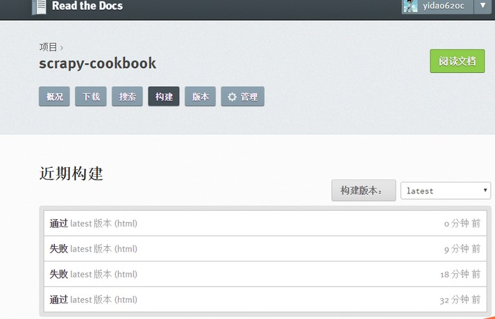
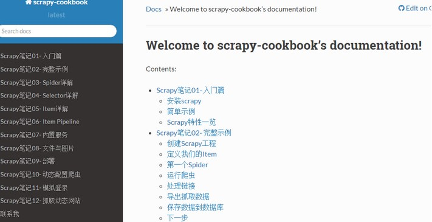

导入到 ReadtheDocs
==================
* GitHub 里选择仓库，然后依次点击 Setting => Integrations & Service => Add service => ReadTheDocs,激活这个选项。
* 在Read the Docs上面注册一个账号
* 登陆后点击 “Import”.
* 给该文档项目填写一个名字, 并添加你在GitHub上面的工程HTTPS链接, 选择仓库类型为Git
* 到 ReadtheDocs import 这个仓库，导入成功后，点击阅读文档，便可看到 Web 效果了。
* 从此只要你往这个仓库push代码，修改.rst文件，readthedoc上面的文档就会自动更新.
在构建过程中出现任何问题，都可以登录readthedoc找到项目中的”构建”页查看构建历史，点击任何一条查看详细日志（会自动构建，也可以手动再构建n次）

如果构建失败，可以在github中打开index.rst把图片中maxdepth:2下边引用的rst文件删了，再构建，通过以后形成文档，然后再修改回来，再构建

.. image:: image7.jpg

